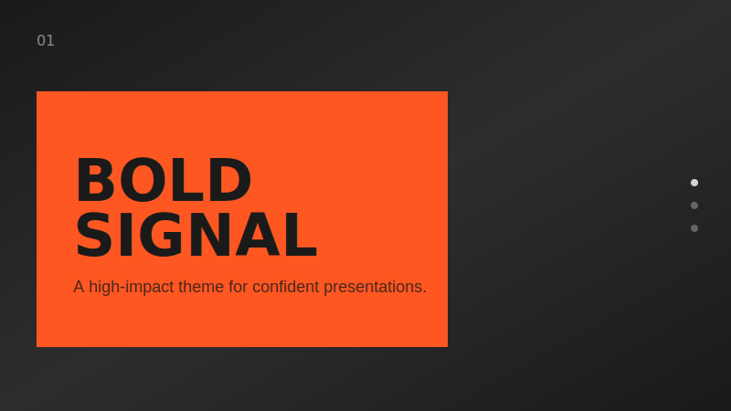
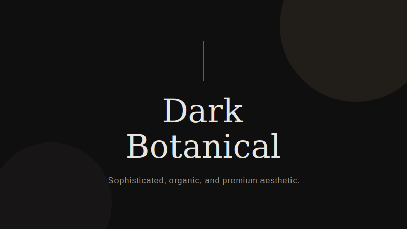
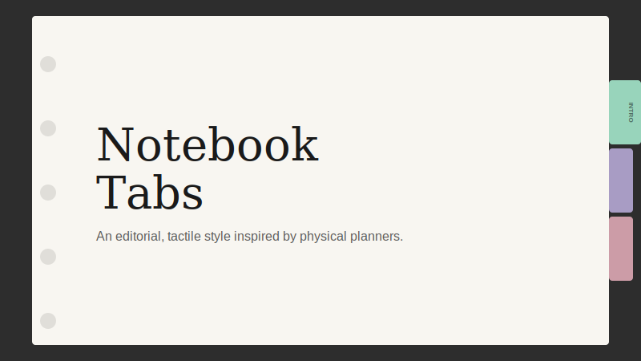

# Frontend Slides

A Claude Code skill for creating stunning, animation-rich HTML presentations — from scratch or by converting PowerPoint files.

## What This Does

**Frontend Slides** helps non-designers create beautiful web presentations without knowing CSS or JavaScript. It uses a "show, don't tell" approach: instead of asking you to describe your aesthetic preferences in words, it generates visual previews and lets you pick what you like.

Here is a deck about the skill, made through the skill:

https://github.com/user-attachments/assets/ef57333e-f879-432a-afb9-180388982478

### Key Features

- **Zero Dependencies** — Single HTML files with inline CSS/JS. No npm, no build tools, no frameworks.
- **Visual Style Discovery** — Can't articulate design preferences? No problem. Pick from generated visual previews.
- **PPT Conversion** — Convert existing PowerPoint files to web, preserving all images and content.
- **Anti-AI-Slop** — Curated distinctive styles that avoid generic AI aesthetics (bye-bye, purple gradients on white).
- **Production Quality** — Accessible, responsive, well-commented code you can customize.

## Installation

### Via Plugin Marketplace (Recommended)

Install directly from Claude Code in two commands:

```bash
/plugin marketplace add zarazhangrui/frontend-slides
/plugin install frontend-slides@frontend-slides
```

Then use it by typing `/frontend-slides` in Claude Code.

### Manual Installation

Copy the skill files to your Claude Code skills directory:

```bash
# Create the skill directory
mkdir -p ~/.claude/skills/frontend-slides/scripts

# Copy all files (or clone this repo directly)
cp SKILL.md STYLE_PRESETS.md viewport-base.css html-template.md animation-patterns.md ~/.claude/skills/frontend-slides/
cp scripts/extract-pptx.py ~/.claude/skills/frontend-slides/scripts/
```

Or clone directly:

```bash
git clone https://github.com/zarazhangrui/frontend-slides.git ~/.claude/skills/frontend-slides
```

Then use it by typing `/frontend-slides` in Claude Code.

## Usage

### Create a New Presentation

```
/frontend-slides

> "I want to create a pitch deck for my AI startup"
```

The skill will:

1. Ask about your content (slides, messages, images)
2. Ask about the feeling you want (impressed? excited? calm?)
3. Generate 3 visual style previews for you to compare
4. Create the full presentation in your chosen style
5. Open it in your browser

### Visual Style Examples

Frontend Slides uses a "show, don't tell" approach. Here are some of the distinctive styles you can choose from:

| **Bold Signal** | **Dark Botanical** | **Notebook Tabs** |
| :---: | :---: | :---: |
|  |  |  |
| [View Live Demo](examples/bold-signal.html) | [View Live Demo](examples/dark-botanical.html) | [View Live Demo](examples/notebook-tabs.html) |

### Convert a PowerPoint

```
/frontend-slides

> "Convert my presentation.pptx to a web slideshow"
```

The skill will:

1. Extract all text, images, and notes from your PPT
2. Show you the extracted content for confirmation
3. Let you pick a visual style
4. Generate an HTML presentation with all your original assets

## Included Styles

### Dark Themes

- **Bold Signal** — Confident, high-impact, vibrant card on dark
- **Electric Studio** — Clean, professional, split-panel
- **Creative Voltage** — Energetic, retro-modern, electric blue + neon
- **Dark Botanical** — Elegant, sophisticated, warm accents

### Light Themes

- **Notebook Tabs** — Editorial, organized, paper with colorful tabs
- **Pastel Geometry** — Friendly, approachable, vertical pills
- **Split Pastel** — Playful, modern, two-color vertical split
- **Vintage Editorial** — Witty, personality-driven, geometric shapes

### Specialty

- **Neon Cyber** — Futuristic, particle backgrounds, neon glow
- **Terminal Green** — Developer-focused, hacker aesthetic
- **Swiss Modern** — Minimal, Bauhaus-inspired, geometric
- **Paper & Ink** — Literary, drop caps, pull quotes

## Architecture

This skill uses **progressive disclosure** — the main `SKILL.md` is a concise map (~180 lines), with supporting files loaded on-demand only when needed:

| File                      | Purpose                        | Loaded When               |
| ------------------------- | ------------------------------ | ------------------------- |
| `SKILL.md`                | Core workflow and rules        | Always (skill invocation) |
| `STYLE_PRESETS.md`        | 12 curated visual presets      | Phase 2 (style selection) |
| `viewport-base.css`       | Mandatory responsive CSS       | Phase 3 (generation)      |
| `html-template.md`        | HTML structure and JS features | Phase 3 (generation)      |
| `animation-patterns.md`   | CSS/JS animation reference     | Phase 3 (generation)      |
| `scripts/extract-pptx.py` | PPT content extraction         | Phase 4 (conversion)      |
| `scripts/deploy.sh`       | Deploy to Vercel               | Phase 6 (sharing)         |
| `scripts/export-pdf.sh`   | Export slides to PDF           | Phase 6 (sharing)         |

This design follows [OpenAI's harness engineering](https://openai.com/index/harness-engineering/) principle: "give the agent a map, not a 1,000-page instruction manual."

## Philosophy

This skill was born from the belief that:

1. **You don't need to be a designer to make beautiful things.** You just need to react to what you see.

2. **Dependencies are debt.** A single HTML file will work in 10 years. A React project from 2019? Good luck.

3. **Generic is forgettable.** Every presentation should feel custom-crafted, not template-generated.

4. **Comments are kindness.** Code should explain itself to future-you (or anyone else who opens it).

## Sharing Your Presentations

After creating a presentation, the skill offers two ways to share it:

### Deploy to a Live URL

One command deploys your slides to a permanent, shareable URL that works on any device — phones, tablets, laptops:

```bash
bash scripts/deploy.sh ./my-deck/
# or
bash scripts/deploy.sh ./presentation.html
```

Uses [Vercel](https://vercel.com) (free tier). The skill walks you through signup and login if it's your first time.

### Export to PDF

Convert your slides to a PDF for email, Slack, Notion, or printing:

```bash
bash scripts/export-pdf.sh ./my-deck/index.html
bash scripts/export-pdf.sh ./presentation.html ./output.pdf
```

Uses [Playwright](https://playwright.dev) to screenshot each slide at 1920×1080 and combine into a PDF. Installs automatically if needed. Animations are not preserved (it's a static snapshot).

## Requirements

- [Claude Code](https://claude.ai/claude-code) CLI
- For PPT conversion: Python with `python-pptx` library
- For URL deployment: Node.js + Vercel account (free)
- For PDF export: Node.js (Playwright installs automatically)

## Credits

Created by [@zarazhangrui](https://github.com/zarazhangrui) with Claude Code.

Inspired by the "Vibe Coding" philosophy — building beautiful things without being a traditional software engineer.

## License

MIT — Use it, modify it, share it.
